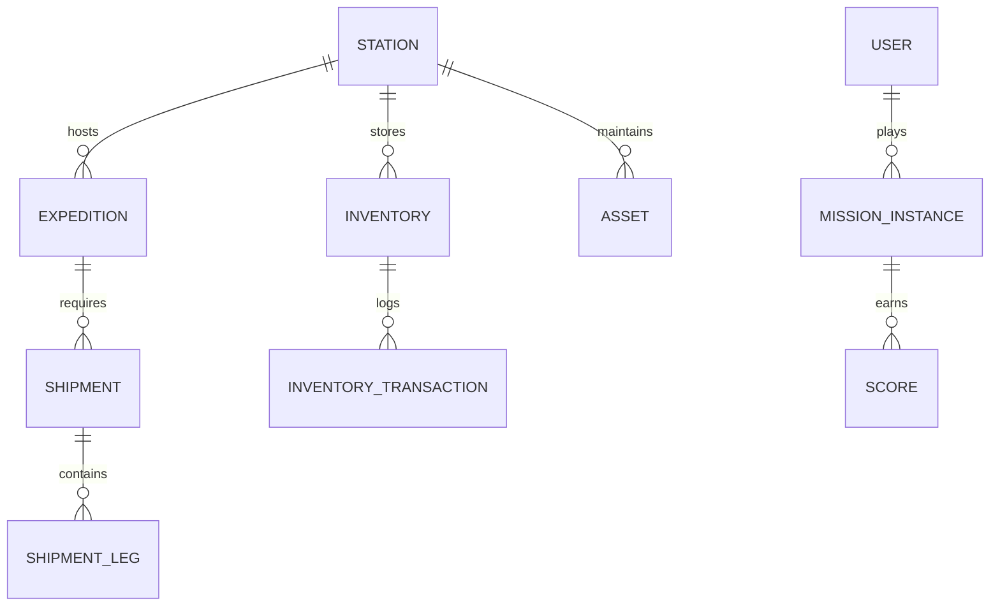

# ❄️ Polar Ops Commander

> **"Plan. Track. Predict. Respond. Explore."**

     -003B57?style=for-the-badge&logo=sqlite&logoColor=white) 

**Polar Ops Commander** is an integrated polar expedition logistics, asset management, decision-support, and mission-based learning platform. Developed for the **Ministry of Earth Sciences (MoES)** and the **National Centre for Polar and Ocean Research (NCPOR)** under the Smart India Hackathon 2026 problem statement **SIH26062**.

---

## 📑 Table of Contents

- [Project Overview](#-project-overview)
- [Real-World Context](#-real-world-context)
- [India's Polar Programme](#-indias-polar-programme)
- [Core Operational Modules](#-core-operational-modules)
- [AI / ML Intelligence](#-ai--ml-intelligence)
- [Simulation & Gamification (Toys & Games)](#-simulation--gamification-toys--games)
- [Education: Polar Explorer](#-education-polar-explorer)
- [User Roles & Security](#-user-roles--security)
- [Architecture & Tech Stack](#-architecture--tech-stack)
- [Database Schema](#-database-schema)
- [API Documentation](#-api-documentation)
- [Setup & Installation](#-setup--installation)
- [Demo Scenario](#-demo-scenario)
- [SIH Relevance & Impact](#-sih-relevance--impact)
- [Prototype Scope & Responsible Claims](#-prototype-scope--responsible-claims)
- [Future Roadmap](#-future-roadmap)
- [Team](#-team)

---

## 🌍 Project Overview

Managing expeditions to Antarctica is a logistical nightmare. When a whiteout hits or an ice-breaker is delayed, the ripple effects can jeopardize entire missions. The margin for error is zero.

**Our philosophy:**
1. Build the real operational logistics platform first.
2. Add intelligence and risk-prediction second.
3. **Gamify the decisions, not the data.**
4. Use simulation for training and student education.

The platform combines **Core Operations** (planning, tracking, inventory), **Intelligence** (risk prediction, alternative planning), **Simulation** (weather events, shipment delays), and **Gamification** (scoring, badges, leaderboards) into a single unified architecture.

---

## 🌪️ Real-World Context

Polar logistics is fundamentally different from commercial logistics due to:
- **Extreme & Rapidly Changing Weather:** Blizzards and whiteouts can ground helicopters instantly.
- **Limited Transport Windows:** Resupply happens only a few times a year.
- **Critical Dependencies:** A missing generator spare part can shut down life support at a field camp.

**The Chain of Consequence:**
`Data → Information → Risk → Recommendation → Decision`

If a shipment is delayed, Polar Ops Commander calculates the downstream impact on inventory burn-rates, flags critical stockouts, and suggests alternative supply routes before the situation becomes an emergency.

---

## 🇮🇳 India's Polar Programme

This platform is inspired by and designed for India's polar infrastructure, managed by **NCPOR**:
- **Antarctica:** Maitri Station, Bharati Station (and historical Dakshin Gangotri).
- **Arctic:** Himadri Station.
- **Himalayas:** Himansh Station.

> **Note:** *This prototype does not claim access to restricted NCPOR operational systems. All data within the platform is simulated for demonstration and hackathon evaluation purposes.*

---

## ⚙️ Core Operational Modules

### 1. Expedition Planning & Readiness
- **Purpose:** Ensure an expedition is 100% prepared before deployment.
- **Mechanism:** Calculates a "Readiness Score" based on operational states (Cargo: 90%, Fuel: 100%, Personnel: 100%, Weather: 70% = **Overall Readiness: 88%**).
- **Status:** 🧪 Implemented (Rules-based prototype).

### 2. Inventory Management
- **Purpose:** Track critical fuel, spares, and food.
- **Features:** Minimum stock thresholds, consumption burn-rates, reservation logic, and automated stockout alerts.
- **Status:** 🧪 Implemented.

### 3. Asset Registry & Lifecycle
- **Purpose:** Manage high-value assets (Snow vehicles, generators).
- **Lifecycle:** `REGISTERED → DEPLOYED → IN USE → MAINTENANCE REQUIRED → READY → RETIRED`.
- **Status:** 🧪 Implemented.

### 4. Shipment & Transport Tracking
- **Purpose:** Multi-leg transport management.
- **Model:** `Shipment → Shipment Legs (Ocean Transport → Aircraft → Snow Vehicle) → Events`.
- **Delay Propagation:** If an ocean leg is delayed, the system automatically flags subsequent legs and calculates inventory impact.
- **Status:** 🧪 Implemented.

### 5. Command Dashboard
- **Purpose:** A centralized, high-contrast, "glass-and-pixel" retro UI providing a holistic view of active expeditions, system loads, and critical alerts.
- **Status:** 🧪 Implemented.

---

## 🧠 AI / ML Intelligence

To move from passive tracking to active decision support, we integrated an intelligence layer.

### 1. Expedition Risk Prediction
- **Input:** Weather forecasts, asset health, inventory burn rates, personnel readiness.
- **Output:** Explainable risk scores (e.g., *72% Risk = 24% Weather + 20% Critical Inventory + 17% Maintenance...*).
- **Status:** 🧪 Implemented (Weighted heuristics engine). 🔮 *Future: XGBoost/scikit-learn trained on historical telemetry.*

### 2. Intelligent Decision Planner
- **Purpose:** Generate alternate routes when emergencies occur.
- **Plans Generated:**
  - **Plan A:** Lowest Risk (Safest)
  - **Plan B:** Lowest Cost (Most Efficient)
  - **Plan C:** Fastest Delivery (Emergency Priority)
- **Status:** 🧪 Implemented (Rule-based constraints). 🔮 *Future: OR-Tools optimization.*

### 3. Natural Language Operations Assistant (Planned)
- **Purpose:** Allow commanders to ask, *"What happens if shipment S-204 is delayed by 24 hours?"* grounded in operational data.
- **Status:** 🚧 Planned Feature.

---

## 🎮 Simulation & Gamification (Toys & Games)

To fulfill the **Toys & Games** theme, we did not build a disconnected mini-game. **The game is an interface to the operational problem.**

### Mission Mode
Trainees and students use the exact same operational engine as the actual Commander, but run in a sandboxed **Mission Simulation**.

**Example Scenario: Whiteout Resupply**
- **Situation:** Field Camp Alpha has critically low fuel.
- **Resources:** 1 aircraft, 2 snow vehicles.
- **Random Event:** Aircraft delayed by 6 hours due to a blizzard.
- **Objective:** Replan and deliver supplies before fuel reaches 0.

### Scoring & Badges
Scoring rewards *decision quality*, not clicking speed:
- `+500` Successful delivery, `+150` Inventory accuracy.
- `-500` Critical stockout, `-300` Asset damage.
- **Badges:** *Zero Stockout*, *Weather Commander*, *Logistics Master*.

---

## 🎓 Education: Polar Explorer

A dedicated **Student Role** allows public users to learn about India's polar history.
- **Features:** Interactive maps of Maitri and Bharati.
- **Progression:** `Polar Explorer → Logistics Planner → Expedition Commander`.
- **Status:** 🧪 Implemented (Frontend map and UI).

---

## 🔒 User Roles & Security

### RBAC (Role-Based Access Control)
1. **COMMANDER:** Full operational read/write access. Can approve AI plans.
2. **LOGISTICS:** Can manage inventory and shipments. Read-only for personnel.
3. **TRAINER:** Can trigger simulated disaster events in Mission Mode.
4. **STUDENT:** Locked to sandboxed educational and gamified simulation modes.

### Data Isolation
`SECURE OPERATIONS ↓ TRAINING ↓ PUBLIC / STUDENT`
*Student data never exposes or alters operational information.*

---

## 🏗️ Architecture & Tech Stack

**Frontend:** React 18, TypeScript, Tailwind CSS, Vite.
**Backend:** Python, FastAPI, Pydantic.
**Database:** SQLite (Prototype) 🔮 *Planned: PostgreSQL + Redis caching.*
**Architecture Pattern:** Event-Driven Architecture.

```mermaid
flowchart TD
    User([User / Commander]) --> UI[React Frontend (Vite)]
    UI <--> API[FastAPI Backend]
    
    subgraph Domain Modules
        API --> Exp[Expedition Engine]
        API --> Inv[Inventory Engine]
        API --> Ship[Shipment Engine]
    end
    
    subgraph Intelligence & Simulation
        Exp -.-> Risk[Risk Engine]
        Ship -.-> EventBus[Event Engine]
        EventBus -.-> Planner[AI Decision Planner]
        EventBus -.-> Game[Mission Scoring Engine]
    end
    
    Domain Modules --> DB[(SQLite Database)]
    Intelligence & Simulation --> DB
```

---

## 🗄️ Database Schema (Conceptual)



---

## 🔌 API Documentation (Representative)

| Method | Endpoint | Purpose | Auth |
|--------|----------|---------|------|
| `GET` | `/api/expeditions/active` | Fetch all ongoing expeditions | Commander/Logistics |
| `POST` | `/api/planner/generate` | Generate Plan A/B/C for an event | Commander |
| `POST` | `/api/events/trigger` | Trigger a simulated blizzard delay | Trainer |
| `GET` | `/api/inventory/{station_id}` | Fetch critical stock levels | Logistics |
| `POST` | `/api/mission/score` | Submit debrief and calculate XP | Student |

---

## 🚀 Setup & Installation

### Prerequisites
- Node.js (v18+)
- Python (3.10+)
- Git

### 1. Clone the Repository
```bash
git clone https://github.com/swoyamsiddhi/polaros.git
cd polaros
```

### 2. Backend Setup
```bash
cd backend
python -m venv venv
source venv/bin/activate  # On Windows: venv\Scripts\activate
pip install -r requirements.txt

# Start FastAPI server (Runs on http://localhost:8000)
uvicorn app.main:app --reload
```

### 3. Frontend Setup
```bash
cd ../frontend
npm install

# Start Vite dev server (Runs on http://localhost:5176)
npm run dev -- --port 5176
```

### 4. Demo Data
The SQLite database (`polarops.db`) comes pre-seeded with simulated operational data for Maitri, Bharati, and Expedition `EXP-2026-013`.

---

## 🎬 Demo Scenario (5-Minute Hackathon Pitch)

1. **Login as Commander:** Show the high-level dashboard and network map.
2. **Identify Risk:** Drill into active expedition `EXP-2026-013` (Readiness: 65%, High Risk).
3. **Analyze:** Check the Inventory module to see critical fuel shortages at Maitri due to delayed shipment `S-204`.
4. **AI Planner:** Hit "Generate AI Plans". The system outputs Plan A (Safe/Slow) and Plan B (Risky/Fast). The Commander selects Plan B.
5. **Switch to Student Mode:** Show how a student logs into the exact same scenario as a "Mission", makes decisions, and is awarded XP and a "Logistics Master" badge based on their choices.

---

## 🎯 SIH Relevance & Impact

| SIH26062 Requirement | Polar Ops Commander Solution | Impact |
|----------------------|------------------------------|--------|
| Logistics Tracking | Unified Shipment & Inventory Engines | Eliminates spreadsheet silos. |
| Predictive Analytics | AI Risk & Forecasting Engine | Prevents catastrophic stockouts. |
| Toys & Games Theme | Mission Mode & Polar Explorer | Educates students using real-world logistical constraints without trivializing operations. |

**Key Statement:** *"The core is not a game. The game is an interface to the operational problem."*

---

## ⚠️ Prototype Scope & Responsible Claims

- **No Restricted Data:** This prototype does not connect to or claim access to real NCPOR operational systems.
- **Simulated Data:** All expeditions, cargo shipments, weather events, and personnel data are synthesized for hackathon demonstration.
- **AI Models:** Currently utilizes heuristics and rule-based risk engines. Deep learning models are marked as future scope.
- **Hardware:** Any mention of physical tracking (RFID/IoT) is conceptual and not implemented in this software-only prototype.

---

## 🛣️ Future Roadmap

- **Phase 1 (Current):** Core Logistics, Rule-based Risk Engine, Gamified Mission Mode.
- **Phase 2 (P1):** Live Weather API integration, OR-Tools optimization for shipment routing.
- **Phase 3 (P2):** Migration to PostgreSQL/Redis, historical telemetry training for ML models.
- **Phase 4 (P3):** Actual IoT/RFID integration for real-time cargo tracking at Antarctic gateways.
- **Phase 5 (P3):** Companion physical educational kit syncing with the digital Polar Explorer.

---

## 👥 Team

- **[Team Member Name]** - Full Stack Developer
- **[Team Member Name]** - AI / ML Engineer
- **[Team Member Name]** - UI/UX & Gamification Designer
- **[Team Member Name]** - Logistics Research

---
*Built with precision for Smart India Hackathon 2026.* 🧊
